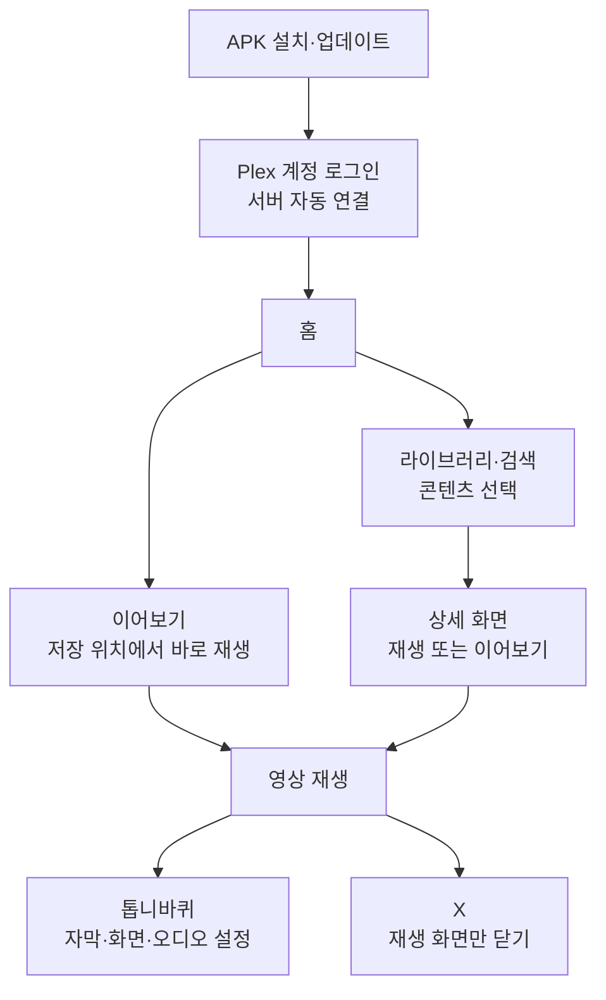
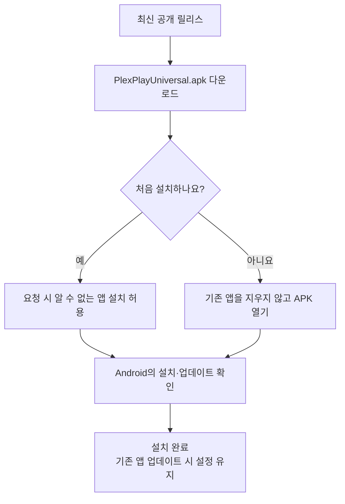
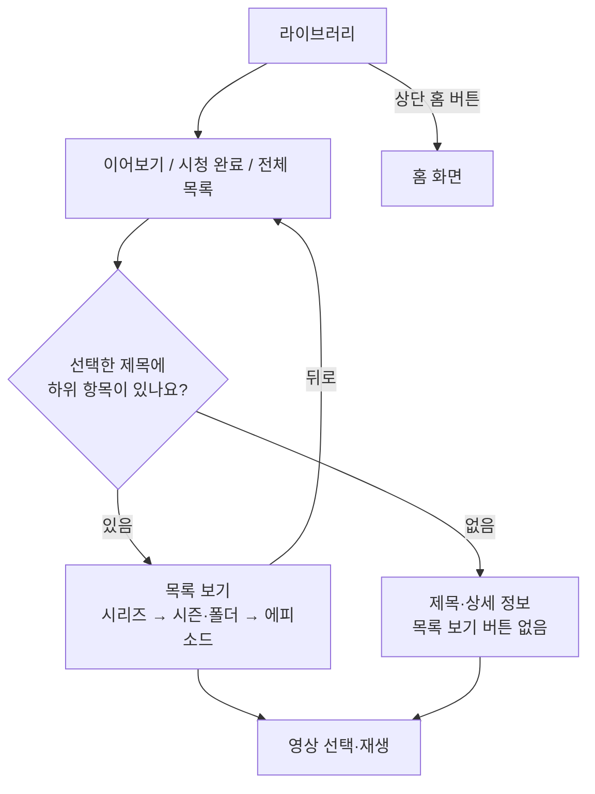
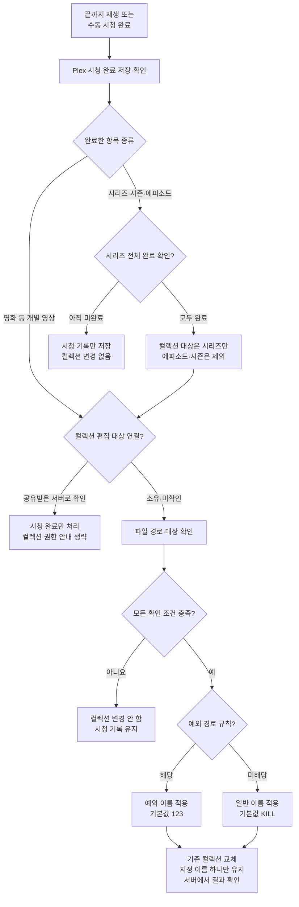
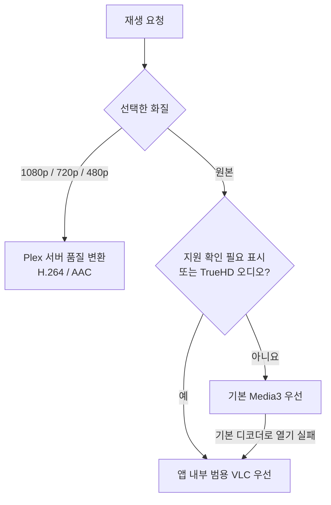
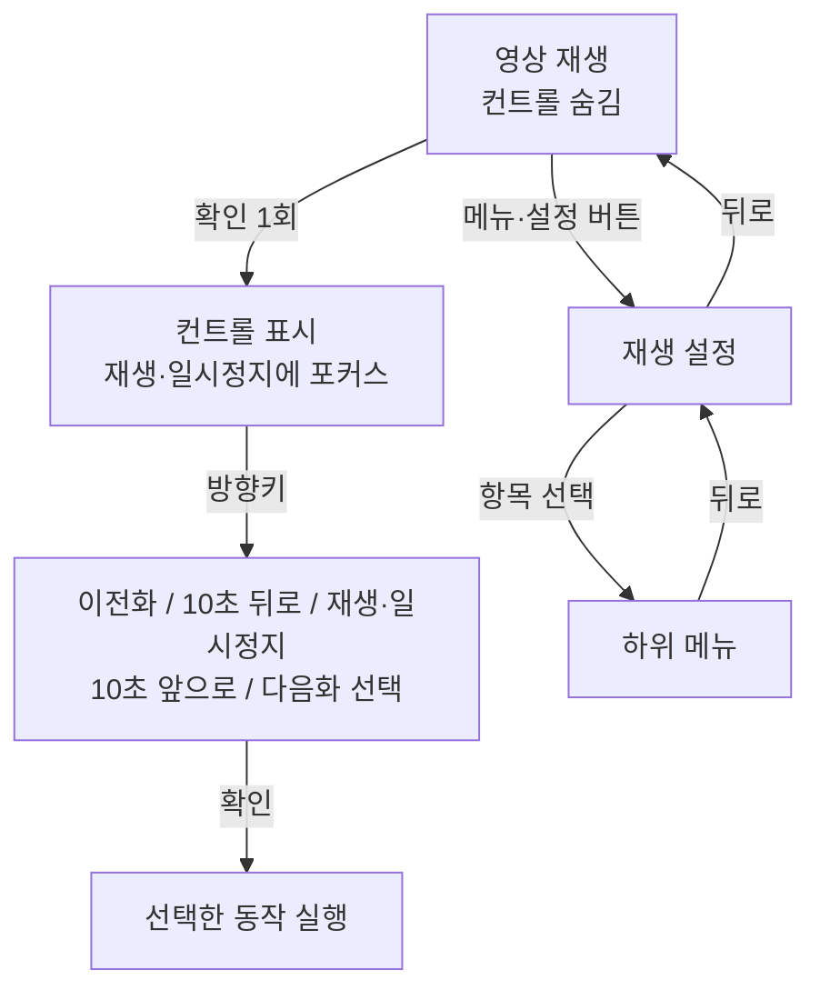
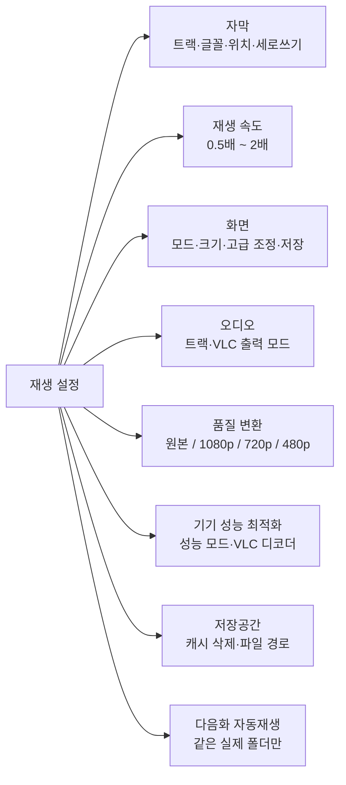
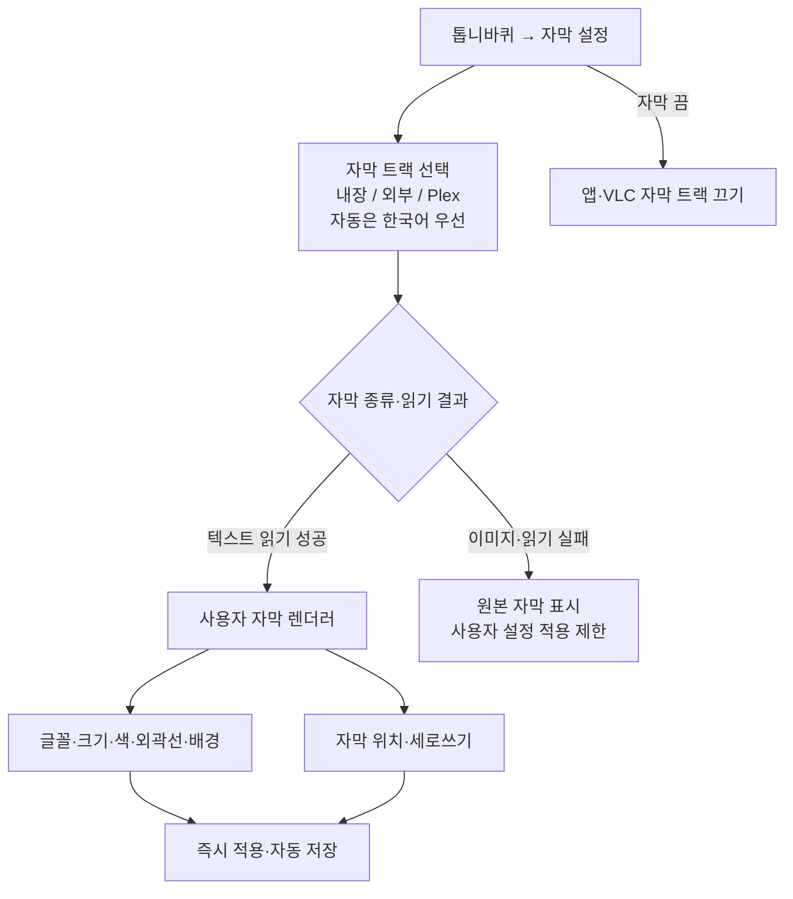
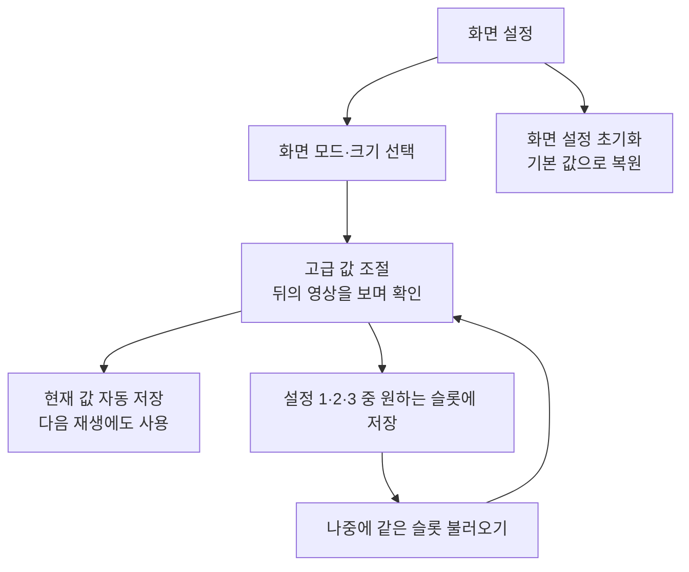

# Plex Play Universal 1.0.32 사용 설명서

외부 프로그램 재생 기능은 제거했습니다. 기존 외부 재생 선택값과 관계없이 앱 내부의 Media3/범용 VLC로 재생합니다. 기존 자막·화면 설정과 내부 이어보기는 유지합니다.

Plex Play Universal은 개인 Plex Media Server의 콘텐츠를 Android 휴대폰, 태블릿·폴더블,
Android TV·OTT 기기에서 탐색하고 범용 코덱으로 재생하는 앱입니다. 이 문서는 1.0.32 버전을
기준으로 작성되었습니다.

이번 버전의 검증 범위는 `BUILD_VERIFICATION_1.0.32.md`에 기록합니다. 설치 파일은 Release APK `PlexPlayUniversal.apk`이며, 파일 해시는 `PlexPlayUniversal.apk.sha256`을 확인하세요. 다른 서명으로 설치된 앱에는 덮어쓸 수 없으므로 설치가 거부되어도 기존 앱을 먼저 삭제하지 마세요. 장편 4K 재생과 HDMI 오디오 출력은 기기 확인이 필요합니다.

**1.0.32 컬렉션 규칙:** 시리즈는 수동으로 전체 시청 완료를 표시하거나 모든 에피소드의 시청 완료가 확인될 때만 **시리즈 자체**에 컬렉션을 적용합니다. 개별 에피소드와 시즌에는 컬렉션을 붙이지 않습니다. 영화의 기존 규칙은 유지하며, 과거 에피소드 태그를 자동 삭제하지 않습니다.

## 웹툰으로 보는 빠른 사용법

로그인부터 재생·자막·화면 저장·컬렉션까지 핵심 사용법을 8컷 웹툰으로 정리했습니다. 웹툰은 1.0.31 기준의 빠른 안내이며, 1.0.32의 시리즈·에피소드 컬렉션 구분은 위 변경 안내와 아래 상세 설명을 따릅니다. 그림 속 화면은 이해를 돕는 예시이며 실제 UI와 다를 수 있습니다.

[웹툰 원본 크게 보기](https://raw.githubusercontent.com/bluemirr8520-lgtm/plex-play-universal-updates/main/docs/images/user-guide-webtoon-v1.0.31.png)

이미지가 표시되지 않으면 [GitHub에서 사용 설명서 열기](https://github.com/bluemirr8520-lgtm/plex-play-universal-updates/blob/main/USER_GUIDE.md)를 이용하세요. 아래 도식과 상세 설명은 같은 내용을 텍스트로 확인할 수 있도록 유지합니다.

## 한눈에 보는 사용 흐름

도식은 1.0.32의 기능을 요약합니다. 실제 버튼 위치를 그대로 그린 화면 캡처는 아니며, 아래 상세 설명의 조건과 제한사항도 함께 확인하세요. 새 컬렉션 규칙을 사용하려면 기존 앱 위에 1.0.32 업데이트를 설치하세요.

### 필요한 기능 바로 찾기

| 하고 싶은 일 | 이동 경로 | 자세히 보기 |
| --- | --- | --- |
| 설치·업데이트 | 최신 릴리스 → APK → Android 설치 확인 | [설치](#2-설치와-업데이트) |
| 홈으로 돌아가기 | 라이브러리 상단 집 아이콘 + 홈 | [라이브러리](#5-라이브러리와-상세-화면) |
| 이어서 재생 | 홈/라이브러리 → 이어보기 카드의 재생 버튼 | [재생 조작](#6-기본-재생-조작) |
| 자막 글꼴·세로쓰기 | 톱니바퀴 → 자막 설정 | [자막](#자막-설정) |
| 밝기·색감 저장 | 톱니바퀴 → 화면 설정 → 설정 1·2·3 | [화면](#화면-설정) |
| 리모컨 버튼 확인 | 확인은 컨트롤 열기, 방향키는 선택·탐색 | [OTT 리모컨](#8-android-tvott-리모컨) |
| 시청 완료 컬렉션 이름 변경 | 홈 → 계정 → 시청 완료 컬렉션 설정 | [컬렉션 규칙](#재생-완료-및-수동-시청-완료-시-컬렉션-지정) |
| 재생·자막 오류 확인 | 증상별 확인 순서 | [문제 해결](#11-문제-해결) |

도식이 코드로 보이는 Markdown 뷰어에서는 [GitHub 사용 설명서](https://github.com/bluemirr8520-lgtm/plex-play-universal-updates/blob/main/USER_GUIDE.md)를 열어 확인하세요.

## 4K/UHD 코덱과 디코더 선택

HEVC/H.265, H.264, AV1, VP9과 TrueHD·DTS/DTS-HD·Dolby Digital(+), AAC·FLAC·PCM 등 주요 영상/오디오 형식을 판별합니다. 원본 파일에서 제공되는 실제 너비·높이·프레임레이트·프로파일·비트 심도를 기기 지원 확인에 반영합니다. 코덱 정보를 알 수 없거나 기기 지원 조회에 실패하면 지원을 확정하지 않고 범용 재생을 사용합니다. 서버가 제공하지 않은 프로파일·크기·프레임레이트까지 검증되었다는 뜻은 아닙니다.

범용/VLC 재생 중 **톱니바퀴 → 기기 성능 최적화 → 비디오 디코더**에서 선택합니다.

- **자동 · 하드웨어 우선**: 기기 디코더를 우선 사용합니다. 재생 오류가 발생하면 PCM 오디오 복구를 우선 처리하고, 필요할 때 해당 영상에 한 번 소프트웨어 디코딩으로 재시도합니다.
- **소프트웨어 · 호환 재생**: 앱 내 디코더로 처리합니다. 설정은 앱별로 저장되고, 변경 시 현재 위치와 일시정지 상태를 유지하여 재연결합니다. 자막·화면 설정은 초기화하지 않습니다.

소프트웨어 디코딩 자체는 원본 해상도를 낮추거나 서버 영상을 재인코딩하지 않습니다. 단, 4K/10비트/고프레임 영상은 CPU 성능에 따라 끊김·발열이 생길 수 있습니다. 품질 변환을 사용자가 선택한 경우 기존 서버 품질 경로를 유지합니다.

HDR10/HDR10+/HLG/Dolby Vision은 코덱 외에 화면·디코더·출력 경로의 지원이 필요합니다. Atmos/DTS:X 객체 출력과 모든 프로파일, 암호화·DRM 콘텐츠의 재생은 보장하지 않습니다. 이미지 자막(PGS/VobSub)의 글꼴 변경은 불가능하며, 기존 텍스트 자막 사용자 설정은 유지됩니다.

## 시리즈 폴더 목록

시리즈 안에 서로 다른 시즌·폴더가 2개 이상 있으면 `All Episodes` 집계 항목 없이 개별 폴더만 표시합니다. 폴더가 1개 이하이면 기존 집계 항목을 유지합니다. 실제 폴더/영상 제목이 `All Episodes`인 경우는 삭제하지 않으며, 서버의 원본 데이터도 바꾸지 않습니다. 같은 폴더에서 이전화·다음화를 연결하는 동작은 그대로입니다.

## 4K 범용/VLC 재생에서 외부 자막 글꼴 선택

1. 재생 중 톱니바퀴 → 자막에서 원하는 외부 텍스트 자막을 선택합니다.
2. 글꼴 항목에서 a시네마B/M/L 등을 고르거나 ‘내 폰트 파일 선택’으로 TTF/OTF 파일을 불러옵니다.
3. 크기·색·외곽선·위치·가로/세로쓰기 설정을 조정합니다. 적용된 텍스트 자막의 설정 변경만으로 영상을 재시작하지 않습니다.

외부 자막은 먼저 파일 본문을 직접 읽고, 필요하면 원본 4K 영상을 열지 않는 자막 전용 보조 경로를 사용합니다. 파일을 읽지 못하면 오류를 안내하며 기본 글꼴로 조용히 바꾸지 않습니다. PGS/VobSub 등의 이미지 자막과 영상에 이미 합성된 글자는 글꼴을 변경할 수 없습니다. 이 기능은 앱 안의 VLC 재생용이며 별도 VLC/MX Player 앱의 설정을 제어하지 않습니다.

## 1. 지원 환경

- Android 8.0(API 26) 이상
- 휴대폰, 태블릿·폴더블, Android TV·OTT
- ARM64, ARM, x86, x86_64
- Plex 계정에 등록되어 있고 외부에서 접속 가능한 Plex Media Server

원본 Plex Play와 패키지 ID가 달라 두 앱을 함께 설치할 수 있습니다. 이 버전은
Media3 기본 재생에 실패했을 때 VLC 로컬 코덱으로 자동 전환합니다.

1.0.9부터 모바일·태블릿·OTT 런처 아이콘과 TV 배너는 남색·금색·청록색의 평면 2D
디자인을 사용합니다. Android 13 이상의 단색 테마 아이콘과 원형 런처 아이콘도 같은
재생 심볼로 표시됩니다.

## 2. 설치와 업데이트

1. [최신 공개 릴리스](https://github.com/bluemirr8520-lgtm/plex-play-universal-updates/releases/latest)에서 `PlexPlayUniversal.apk`를 내려받습니다. GitHub 로그인은 필요하지 않습니다.
2. 처음 설치할 때 Android가 요청하면 브라우저 또는 파일 관리자의
   `알 수 없는 앱 설치` 권한을 허용합니다.
3. 내려받은 APK를 열고 `설치`를 선택합니다.
4. 기존 버전 위에 설치하면 로그인 토큰과 사용자 설정이 유지됩니다.

현재 Universal 업데이트 저장소는 공개입니다. 기존 앱을 삭제하지 않고 최신 APK를 위에 설치하면 됩니다. 릴리스에는 파일 확인용 `PlexPlayUniversal.apk.sha256`과 사용 설명서를 함께 제공합니다. AAR 파일은 소스 빌드용이므로 일반 설치자는 다운로드할 필요가 없습니다. 2026-09-30에 구버전 릴리스를 정리했으며, 당시 첨부·설명은 별도 로컬 백업으로 보존하고 Git 태그·소스 이력은 유지했습니다. 빌드용 코덱을 보관한 v1.0.31 릴리스는 유지합니다.

공개 채널에 접근 가능한 경우에만 앱의 자동 조회·다운로드·SHA-256 검증이 동작합니다. 마지막 Android `설치` 또는 `업데이트` 확인은 사용자가 직접 눌러야 합니다. GitHub 비밀 토큰을 APK에 포함하지 않습니다.

## 3. 로그인

1. Plex 사용자명 또는 이메일과 비밀번호를 입력합니다.
2. `로그인 및 서버 자동 연결`을 선택합니다.
3. 앱이 Plex 계정에 등록된 서버 주소를 확인하고 접속 가능한 서버를 자동 선택합니다.

서버 주소를 직접 입력할 필요는 없습니다. 사용자명과 비밀번호는 Plex HTTPS 로그인에만
사용되고 기기에 저장되지 않습니다. 발급된 Plex 토큰은 Android Keystore 키로 암호화해
앱 전용 저장소에 보관합니다.

Google 또는 Apple 로그인만 사용한 계정은 Plex 계정 설정에서 별도 비밀번호를 먼저
만들어야 합니다.

## 4. 홈 화면

홈 화면은 Plex와 비슷한 행 중심 구조로 구성됩니다.

- 이어보기: 마지막 재생 위치가 있는 콘텐츠를 바로 재생합니다.
- 라이브러리: 영화, TV 프로그램, 음악 등 서버 라이브러리로 이동합니다.
- 최근 추가: 라이브러리별 최신 콘텐츠를 표시합니다.
- 검색: Plex 전체 라이브러리에서 제목을 검색합니다.
- 새로고침: 홈과 라이브러리 데이터를 다시 불러옵니다.
- 라이브러리 순서: 홈에 표시할 라이브러리 순서를 직접 저장합니다.
- 계정: 로그인 상태를 확인하거나 로그아웃합니다.

TV 프로그램의 최근 추가 항목은 에피소드 사진 대신 프로그램 포스터로 표시됩니다.
시청하지 않은 에피소드 수가 있으면 라이브러리 포스터 오른쪽 위에 작은 숫자로
표시됩니다.

## 5. 라이브러리와 상세 화면

**시리즈 폴더가 2개 이상:** `All Episodes` 집계 항목 대신 개별 폴더만 표시합니다. 상세 팝업에서는 먼저 팝업을 닫은 후 홈 버튼을 선택하세요.

- 라이브러리 상단 왼쪽의 **집 아이콘 + 홈** 버튼을 누르면 홈 화면으로 이동합니다. 목록을 아래로 스크롤해도 버튼은 상단에 남습니다.
- 시리즈·시즌 등 하위 폴더에서는 **뒤로**는 상위 목록으로, **홈**은 홈 화면으로 이동합니다. 상세 팝업이 열려 있으면 먼저 닫은 후 상단 홈 버튼을 선택하세요.
- 휴대폰은 터치, OTT는 방향키로 홈 버튼에 포커스를 옮긴 뒤 확인 버튼을 누릅니다. 포커스된 홈 버튼은 금색 바탕·흰 테두리로 강조됩니다. 기존 OTT 사이드바의 홈도 사용할 수 있습니다.
- 좁은 화면에서는 검색창을 제목 아래 별도 줄에 표시합니다. 홈으로 이동하면 키보드를 닫고 기존 홈 목록을 새로 불러옵니다.
- 라이브러리 항목은 가나다순으로 전체 표시됩니다.
- 각 라이브러리 안에서 이어보기, 시청 완료, 전체 목록을 구분해 볼 수 있습니다.
- 프로그램은 `프로그램 → 시즌 → 에피소드` 순서로 탐색합니다.
- 재생 버튼은 상세 하위 메뉴를 거치지 않고 바로 재생합니다.
- `목록 보기`는 해당 제목 폴더에 실제 하위 항목이 있을 때만 표시됩니다. 하위
  항목이 없으면 목록 버튼 없이 제목과 상세 정보가 바로 표시됩니다.
- 상세 화면 아래에서 출연 배우의 다른 작품과 비슷한 장르의 작품을 확인할 수 있습니다.
- 재생 가능한 영상의 상세 화면에는 해상도·비디오 코덱·컨테이너와 오디오 코덱·
  채널·언어가 표시됩니다. 서버에 해당 정보가 없는 항목은 표시하지 않습니다.
- Plex가 포맷 정보를 제공하면 홈 포스터와 상세 화면에 Dolby Vision, HDR10+,
  HDR10, HLG, AV1/HEVC, Dolby Atmos/TrueHD/Digital Plus 배지가 표시됩니다.
- 상세 화면의 초록 표시는 원본 재생 지원, 금색 표시는 기기의 원본 재생 지원 여부를
  확인해야 하는 항목을 뜻합니다. 금색 표시가 있어도 자동 호환 변환은 실행하지 않습니다.
- 항목 메뉴에서 `시청 완료로 표시`, `시청하지 않음으로 표시`, `이어보기에서 제거`를
  선택할 수 있습니다.
- `시청 완료로 표시` 또는 `시청하지 않음으로 표시`를 선택해도 현재 상세 화면과
  라이브러리 위치가 유지되며 표시 상태만 즉시 바뀝니다.
- 실제 영상 재생이 끝났을 때 시청 완료로 기록되고 재생 화면이 닫힙니다.

## 6. 기본 재생 조작

### 라이브러리 이어보기

라이브러리를 선택하면 전체 목록 위에 해당 라이브러리의 이어보기 목록이 표시됩니다. 진입할 때 서버에서 새로 불러오며, 재생 일시정지·종료 시 위치 저장 후 갱신합니다. 카드의 재생 버튼을 누르면 상세 메뉴를 거치지 않고 이어서 재생합니다. 목록이 없으면 ‘이 라이브러리에 이어볼 영상이 없습니다’가 표시됩니다. 검색 결과나 시리즈·폴더 안에서는 라이브러리 전체 이어보기 목록을 반복해서 표시하지 않습니다.

### 우측 상단 화면 크기 아이콘

재생 화면을 터치하거나 리모컨으로 조작 버튼을 표시하면 우측 상단 설정 아이콘 옆에 축소(−), 확대(+), 꽉 채우기 아이콘이 나타납니다. 기본 재생과 범용/VLC 재생 모두 지원합니다.

- 축소·확대: 85% → 100% → 115% → 130% 단계로 조절합니다.
- 꽉 채우기: 영상 비율을 유지하며 화면 여백을 채웁니다. 가장자리가 일부 잘릴 수 있습니다. 다시 누르면 화면 맞춤(100%)으로 돌아갑니다. 영상 파일 자체에 포함된 검은 띠를 분석해 제거하는 기능은 아닙니다.
- 리모컨 포커스는 흰 배경과 금색 테두리로 표시합니다. 꽉 채우기 선택 상태도 테두리로 구분합니다.
- 변경 즉시 적용하고 기존 화면 크기 설정에 저장합니다. 자막 크기는 변경하지 않습니다. 기존 설정 메뉴와 핀치 제스처도 유지합니다.

### 재생 완료 및 수동 시청 완료 시 컬렉션 지정

컬렉션 쓰기 권한이 실제로 거부되면 조용히 건너뜁니다. 시청 완료 저장 실패·일반 통신 오류는 별도로 안내합니다. 시리즈는 **전체 에피소드와 모든 파일 경로가 같은 최종 컬렉션명**으로 판정될 때만 시리즈 자체를 변경하며, 에피소드 컬렉션을 일괄 교체하지 않습니다.

| 파일 경로의 공통 부분 | 적용할 컬렉션 |
| --- | --- |
| `GDRIVE/VIDEO/AV/자막B/` 아래 모든 깊이의 `NO_META/` 및 하위 폴더 | 예외 이름 · 기본 `123` |
| `GDRIVE/VIDEO/AV/자막B/기타/` 및 하위 폴더 | 예외 이름 · 기본 `123` |
| 그 밖의 확인 가능한 대상 경로 | 일반 이름 · 기본 `KILL` |
| 경로 누락·불명확 또는 여러 파일의 최종 이름 충돌 | 컬렉션 변경 안 함 |

`/mnt/GDS2/` 같은 앞부분은 달라도 됩니다. `NO_META2`·`기타2`는 해당 폴더와 다릅니다. 두 이름은 **홈 → 계정 → 시청 완료 컬렉션 설정 → 저장**에서 변경합니다.

**일반 사용자/공유 서버:** 1.0.30부터 로그인 시 공유받은 서버로 확인되면 시청 완료만 저장하고 컬렉션 편집은 건너뜁니다. 컬렉션 권한 부족 안내를 띄우지 않으며 다음 영상 재생도 유지합니다. 기존 로그인에 소유 여부가 없는 경우에도 컬렉션 쓰기 요청의 401/403 권한 거부는 조용히 처리합니다. 시청 완료 자체의 저장 실패나 일반 통신 오류는 계속 안내합니다. 새 로그인에서 소유 여부를 확인할 수 있으며, 로그아웃하면 이전 서버의 소유 여부 정보는 삭제됩니다. 아래 컬렉션 변경 기능은 서버 소유자/편집 권한이 있는 연결에 적용합니다.

특정 라이브러리 이름 제한 없이 Plex에 등록된 모든 영상 라이브러리에 적용합니다. 영화·클립 등의 개별 영상은 정상 재생 완료 또는 수동 ‘시청 완료’ 시, 시리즈는 전체 시청 완료 확인 시 기존 컬렉션을 일반 컬렉션명(기본 `KILL`) 하나로 교체합니다. **개별 에피소드와 시즌 자체에는 컬렉션을 붙이지 않습니다.** 새로 추가하거나 이름을 바꾼 라이브러리도 포함합니다. 다음 공통 경로 규칙에 해당하면 예외 경로 컬렉션명(기본 `123`) 하나로 교체합니다.

- `GDRIVE/VIDEO/AV/자막B/` 아래 **모든 깊이의 `NO_META` 폴더와 그 하위 폴더**. 직접 위치한 NO_META, Uncensored/NO_META, Western/NO_META뿐 아니라 `새폴더/분류/NO_META/하위폴더`도 포함합니다.
- `GDRIVE/VIDEO/AV/자막B/기타` 및 그 하위 폴더. 기존 기타 규칙은 그대로 유지합니다.

1.0.29부터 `/mnt/GDS2/`, `/mnt/GDS9/`, `/data/storage/` 등 앞부분은 달라도 됩니다. 예를 들어 `/mnt/GDS9/GDRIVE/VIDEO/AV/자막B/NO_META/a.mkv`는 예외 대상입니다. `AV/자막B/NO_META`만 있고 `GDRIVE/VIDEO`가 없는 경로는 예외가 아닙니다. Linux 경로는 대소문자를 구분하며 Windows 드라이브·UNC 경로는 대소문자를 구분하지 않습니다. URL과 불명확한 경로는 사용하지 않습니다.

이름 변경: **홈 → 계정 → 시청 완료 컬렉션 설정**에서 일반 이름과 예외 이름을 입력하고 **저장**합니다. 각각 1~100자이며 앞뒤 공백은 제거합니다. 빈 이름·줄바꿈·제어문자는 저장할 수 없습니다. 두 규칙을 같은 컬렉션으로 모으려면 두 이름을 같게 지정할 수 있습니다. ‘기본 이름으로 되돌리기’는 입력란을 KILL/123으로 바꾸며, 저장을 눌러야 적용합니다. 취소하면 이전 설정이 유지됩니다.

설정은 이 기기에 저장되어 재실행·업데이트 후 유지되고, 다른 기기와 자동 동기화하지 않습니다. 다음 자동·수동 시청 완료와 시리즈 완료부터 적용합니다. 이름 저장만으로 Plex의 기존 컬렉션 이름이나 과거 시청 목록을 일괄 변경하지 않습니다. 해당 항목을 다시 ‘시청 완료’ 처리하면 새 이름을 적용할 수 있습니다. 리모컨 위·아래로 입력란, 저장, 기본 이름, 취소를 이동할 수 있습니다.

같은 이름으로 시작하는 다른 폴더(예: `NO_META2`, `기타2`)는 예외 대상이 아닙니다. 음악·사진·에피소드·시즌 자체의 컬렉션은 변경하지 않습니다. 중간 재생 종료·다음 영상 건너뛰기·보지 않음 표시·이어보기 제거에는 적용하지 않으며, 기존 시청 기록을 일괄 변경하지도 않습니다. 수동 시청 완료는 서버에서 새로 읽은 파일 경로와 기존 컬렉션을 기준으로 처리합니다. 이미 시청 완료인 영화·시리즈에도 항목 메뉴의 ‘시청 완료’를 다시 눌러 적용할 수 있습니다.

시리즈 자체에서 ‘시청 완료’를 누르면 Plex에 시리즈 전체의 시청 완료를 요청하고, 서버의 전체 에피소드 수와 완료 에피소드 수를 다시 확인합니다. 개별 에피소드의 자동·수동 완료 또는 시즌의 수동 완료 뒤에도 부모 시리즈를 확인합니다. 미시청 에피소드가 남았으면 컬렉션은 바꾸지 않으며 실패 안내도 표시하지 않습니다. 모든 에피소드를 완료한 경우에만 시리즈 자체에 적용합니다. 서버의 완료 정보가 늦게 반영되면 읽기만 최대 3회 확인하며 나머지 에피소드를 강제로 시청 완료 처리하지 않습니다.

시리즈의 모든 에피소드와 모든 원본 파일 경로가 같은 최종 컬렉션명을 가리킬 때만 시리즈의 기존 컬렉션을 지정 이름 하나로 교체합니다. 에피소드 컬렉션을 쓰거나 과거 에피소드 태그를 삭제하지 않습니다. 목록 누락·경로 충돌 등 변경 결과를 확인할 수 없는 경우 시청 기록은 보존하고 컬렉션 실패를 안내합니다. 일반 사용자의 권한 부족은 위 규칙대로 처리합니다.

시리즈·시즌의 완료 표시도 서버의 에피소드 완료 수를 기준으로 합니다. 화면을 다시 열어도 같은 기준으로 표시하며, 새 미시청 에피소드가 추가되면 미완료로 바뀌는 것이 정상입니다. 시청 완료·보지 않음 저장 결과가 확인되지 않으면 임의로 표시를 바꾸지 않고 안내합니다. 개별 에피소드의 완료는 해당 에피소드의 시청 기록만 저장한 뒤 시리즈 전체 완료 여부를 확인합니다. 과거 완료 시리즈를 자동 일괄 처리하지 않습니다.

실제 파일 경로가 불명확하면 컬렉션을 변경하지 않습니다. Plex 라이브러리 편집 권한이 필요하며, 일반 사용자 권한 부족을 제외한 오류는 안내하고 시청 완료 기록과 다음 영상 재생은 유지합니다. 서버에 저장된 태그를 다시 읽어 지정한 이름 하나만 남았는지 확인합니다. 건너뛴 컬렉션 변경을 성공했다고 표시하지 않습니다. 영화 파일 자체나 다른 종류의 태그는 삭제하지 않습니다.

영화 등의 수동 시청 완료는 영상에 등록된 모든 파일 버전의 경로를 확인하고, 정상 재생 완료는 실제 재생한 파일의 경로를 기준으로 합니다. 시리즈는 마지막 재생 파일만 보지 않고 항상 모든 에피소드의 모든 파일 경로를 확인합니다. 최종 컬렉션명이 충돌하거나 어느 한 경로라도 누락·불명확하면 컬렉션을 변경하지 않고 안내합니다. 이미 지정 태그 하나만 있는 경우 쓰기 없이 재확인하며, 컬렉션 쓰기 중 통신 오류는 자동 재시도하지 않습니다. 과거 시청 기록을 자동 일괄 처리하지는 않습니다.

### 재생 컨트롤

- 화면 한 번 터치: 재생 컨트롤, 제목, 닫기 버튼을 표시합니다.
- X 버튼: 앱은 종료하지 않고 현재 재생 화면만 닫습니다.
- 재생/일시정지: 중앙 재생 버튼을 사용합니다. 리모컨은 확인 버튼으로 컨트롤을
  연 뒤 재생/일시정지 버튼을 선택합니다.
- 이전화·다음화: 재생 컨트롤의 좌우 에피소드 버튼을 사용합니다. 현재 영상과 실제 파일의 상위 폴더가 같은 항목만 이동합니다.
- 다음화 자동재생: 재생 설정에서 켜거나 끕니다. 같은 폴더의 다음 영상에만 적용되며, 폴더의 마지막 영상에서는 다른 폴더로 넘어가지 않고 종료합니다.
- 같은 시즌·라이브러리·이어보기 목록에 있어도 파일 폴더가 다르면 다음 재생에서 제외합니다. 하위 폴더는 별도 폴더이며, 실제 파일 경로를 확인할 수 없는 항목도 자동으로 넘기지 않습니다.
- 이어보기: 저장된 Plex `viewOffset` 위치에서 시작합니다.

`원본` 화질은 기기 판정과 관계없이 Plex 원본 스트림을 직접 재생하며 자동 호환 변환을
사용하지 않습니다. 원본 재생이 어려운 기기에서는 사용자가 재생 설정에서 1080p, 720p,
480p를 직접 선택할 수 있으며, 이 경우에만 Plex H.264/AAC 품질 변환을 사용합니다.

일시적인 네트워크·HTTP 재생 오류가 발생하면 현재 스트림을 최대 두 번 자동으로
다시 연결합니다. 변환 스트림이 계속 실패하고 원본 경로가 있으면 현재 위치를 유지해
원본 화질로 자동 복구합니다.

### 범용 코덱 자동 전환

**범용 VLC는 앱 내부의 재생 엔진**입니다. 별도 외부 앱이나 서버 품질 변환과 다릅니다. 원본을 선택하면 자동으로 해상도를 낮추지 않으며, 모든 4K/HDR·오디오 출력 지원을 보장하는 것은 아닙니다.

Android 기본 디코더가 컨테이너·영상·오디오를 열지 못하면 앱이 현재 위치를 기억한 뒤
`범용 코덱 재생` 화면으로 자동 전환합니다. 이 화면은 VLC 3.7.5의 로컬 코덱을 사용하며
Plex 서버에 강제 호환 변환을 요청하지 않습니다. WMV/VC-1, MPEG-2, 다양한 MKV·AVI,
HEVC·AV1과 DTS·FLAC·Opus 등 기기별 기본 지원 차이가 큰 형식을 폭넓게 처리합니다.

상세 화면에서 금색으로 `이 기기에서 원본 재생 지원 여부 확인 필요`가 표시되는 영상은
실패를 기다리지 않고 처음부터 범용 코덱으로 재생합니다. 1.0.19부터 원본 품질의 TrueHD
오디오 파일도 기본 디코더 지원 표시와 관계없이 앱 내 VLC를 우선합니다. 그 외 초록색
원본 지원 영상은 기존 재생기를 우선하며, 사용자가 1080p·720p·480p 품질을 선택한 경우에는 Plex 변환 스트림을
우선합니다.

이 동작은 원본 영상 스트림과 기존 사용자 텍스트 자막·화면 설정을 유지하면서 앱 안에서
오디오를 처리하는 방식입니다. PotPlayer는 내장되어 있지 않으며 별도 VLC 앱도 필요하지 않습니다.

범용 화면의 톱니바퀴는 포커스되면 노란 배경과 굵은 흰색 테두리로 표시되며,
기본 재생과 같은 메인 메뉴와 하위 메뉴 구조로 열립니다.
리모컨 뒤로 버튼은 `하위 메뉴 → 재생 설정 메인 → 재생 화면` 순서로 이동합니다.
다음 항목을 사용할 수 있습니다.

- 자막, 재생 속도, 화면 크기, 오디오, 재생 품질 변환, 기기 최적화, 저장공간
- 자막 끔, 한국어 우선 자동 자막, 내장 자막, Plex 외부 자막 선택
- a시네마B·M·L, 고운바탕, 고딕·명조·둥근 고딕 및 기기의 TTF/OTF 글꼴 선택
- 자막 크기, 글자색, 배경, 외곽선, 가로·세로 자유 위치와 가로·세로쓰기
- 같은 폴더의 다음 영상 자동재생

범용 재생도 오른쪽 세로 볼륨, 왼쪽 세로 밝기, 아래쪽 가로 탐색, 위쪽 가로 화면
크기, 두 손가락 확대와 자막 위치 드래그 제스처를 지원합니다. 리모컨 확인 버튼을 한 번
누르면 중앙 컨트롤이 열리고 방향키로 이전화·10초 뒤로·재생/정지·10초 앞으로·다음화를
선택할 수 있습니다. 좌우 버튼을 길게 누르면 10초 단위로 연속 탐색합니다.

화면 설정에는 표준·선명·영화·밝은 공간·눈이 편안한 화면 모드, 화면 크기, 고급
밝기·명암·블랙 레벨·색 농도·색 온도와 설정 1·2·3 저장·불러오기가 포함됩니다.
호환 재생은 기기 호환성이 높은 SurfaceView 출력을 사용합니다. 1.0.12에서는 이전 버전에서
저장된 낮은 창 밝기를 한 번 100%로 정상화하며, 이후 사용자가 조절한 밝기는 유지합니다.
화면 밝기와 화면 크기는 즉시 적용되고 일부 OTT 기기에서는 고급 색 조정의 적용 범위가
제한될 수 있습니다.

자막 사용자 설정을 바꾸면 값이 즉시 저장되고 선택한 자막 트랙과 현재 위치를 보존한 채
활성 자막 렌더러에 다시 적용되므로 캐시를 지우거나 앱을 재실행할 필요가 없습니다. 외부
텍스트 자막과 내장 텍스트 자막은 기본 재생과 동일한 사용자 자막 렌더러로 우선 표시됩니다.
Plex의 내장 자막 추출에 실패하면 원본 파일에서 오디오·비디오를 끈 보조 플레이어가 텍스트
트랙만 읽어 다시 시도합니다. SRT·ASS·SSA·VTT·TTML·SMI와 UTF-8/UTF-16 텍스트를 읽으며
사용자 글꼴·크기·색·배경·외곽선·자유 위치·세로쓰기를 적용합니다.

1.0.8부터 Plex 외부 자막 다운로드가 중간에 끊겨도 이미 받은 텍스트를 보존하고 다시
연결합니다. 외부 자막 보조 경로도 기본 재생과 같은 Media3 자막 구성 방식을 사용하며,
빈 줄이 생략된 SRT 파일도 각 시간 구간을 따로 인식합니다.

선택한 텍스트 자막을 사용자 렌더러로 읽는 중이거나 읽지 못했을 때는 자막 설정 화면에
현재 상태를 표시합니다. 읽기에 실패하면 재생을 중단하지 않고 LibVLC 원본 자막 트랙으로
안전하게 전환합니다. 이 경우 지원되는 범위에서만 크기·색·외곽선·세로 여백이 적용됩니다.
내장 ASS의 자체 스타일과 PGS/VobSub 같은 이미지 자막은 원본 형식 특성상 사용자 글꼴·
색·워드프로세서식 세로쓰기를 완전히 적용할 수 없습니다.

## 7. 모바일·터치 제스처

화면에서 **제스처를 시작하는 위치**를 구분하세요.

| 왼쪽 가장자리 | 화면 안쪽 | 오른쪽 가장자리 |
| :---: | :---: | :---: |
| 세로 스와이프 ↕ 현재 창 밝기 | **위쪽:** 가로 스와이프 ↔ 화면 크기 | 세로 스와이프 ↕ 미디어 볼륨 |
| 밝기는 가장자리에서 시작 | **자막 주변:** 드래그로 자막 이동 **두 손가락:** 핀치 확대 | 볼륨은 가장자리에서 시작 |
|  | **아래쪽:** 가로 스와이프 ↔ 재생 위치 |  |

- 화면 맨 오른쪽 가장자리 세로 스와이프: 미디어 볼륨
- 화면 맨 왼쪽 가장자리 세로 스와이프: 현재 재생 창 밝기
- 화면 아래쪽 가로 스와이프: 재생 위치 이동
- 화면 위쪽 가로 스와이프: 화면 크기 단계 변경
- 두 손가락 핀치: 100%, 115%, 130% 화면 확대 단계 선택
- 표시 중인 가로 자막 주변 드래그: 가로 자막 위치 이동
- 표시 중인 세로 자막 주변 드래그: 세로 자막 위치 이동

자막 이동 구역과 볼륨·밝기 구역은 분리되어 있습니다. 볼륨은 맨 오른쪽 가장자리,
밝기는 맨 왼쪽 가장자리에서 시작해야 합니다.

## 8. Android TV·OTT 리모컨

| 입력 | 재생 컨트롤이 닫혔을 때 | 설정·슬라이더 조작 시 |
| --- | --- | --- |
| 확인 1회 | 컨트롤 표시 | 선택한 항목 실행 |
| 확인 길게 | 별도 기능 없음 | 별도 길게 누르기 기능 없음 |
| 좌우 | 10초 뒤로·앞으로 | 선택한 슬라이더만 조절 |
| 좌우 길게 | 10초 단위 연속 탐색 | 재생 탐색이 아닌 현재 설정 조작 |
| 위아래 | 컨트롤·정보 표시 | 이전·다음 항목으로 포커스 이동 |
| 뒤로 | 현재 재생 화면의 뒤로 동작 | 하위 메뉴 → 설정 메인 → 재생 화면 |

- 상세 화면: 재생/이어보기/목록 보기 버튼이 먼저 선택되며, 위를 누르면 뒤로가기,
  아래를 누르면 다음 항목으로 이동합니다.
- 확인 버튼 한 번: 재생 컨트롤을 열고 재생/일시정지 버튼에 포커스
- 컨트롤이 열린 상태의 확인 버튼: 선택한 이전화, 10초 뒤로, 재생/일시정지,
  10초 앞으로, 다음화 실행
- 리모컨 재생/일시정지 버튼: 즉시 재생 또는 일시정지
- 확인 버튼 길게: 별도 기능 없음
- 컨트롤이 닫힌 상태의 왼쪽/오른쪽: 10초 뒤로/앞으로
- 왼쪽/오른쪽 길게: 누르는 동안 10초 단위 연속 탐색
- 위/아래 짧게: 재생 컨트롤과 정보 표시
- 위/아래 길게: 재생 설정 열기
- 이전 트랙/채널 아래: 이전화, 이전화가 없으면 10초 뒤로
- 다음 트랙/채널 위: 다음화
- 메뉴/설정/정보/가이드 버튼: 재생 설정 열기
- 자막 버튼: 자막 설정 바로 열기
- 언어 전환 버튼: 오디오 설정 바로 열기
- 정지 버튼: 현재 재생 화면 닫기
- 뒤로 버튼: 서브 메뉴 → 재생 설정 메인 → 재생 화면 순서로 돌아가기

재생 설정이 열린 동안 리모컨 입력은 뒤의 홈 화면으로 전달되지 않습니다. 선택된
항목은 흰색 4dp 테두리와 밝은 금색 배경, 굵은 글자로 확실하게 표시됩니다. 설정을
열면 현재 페이지의 첫 번째 조작 항목으로 포커스가 자동 이동합니다.

## 9. 재생 설정

재생 화면에서 톱니바퀴를 선택하거나 리모컨의 메뉴·설정 버튼을 누르면 열립니다.

기능별 묶음도이며, 기본 재생과 범용 재생에서 일부 하위 메뉴 이름·위치는 다를 수 있습니다. 설정을 여는 것만으로 재생·일시정지 상태를 바꾸지 않습니다.

1.0.16에서는 기본 재생과 범용 재생 모두 영상과 같은 창 위에 설정 패널을 표시합니다.
설정을 열고 닫거나 하위 메뉴를 이동하는 동작은 재생·일시정지 상태를 바꾸지 않으며,
이미 일시정지한 영상을 강제로 재생하지 않습니다. 뒤로 버튼은 하위 메뉴부터 차례로 닫습니다.
이 변경의 실제 기기별 영상·소리 연속 재생 여부는 아직 확인이 필요합니다.

### 자막 설정

영상에 이미 합성된 글자는 자막 트랙이 아니므로 `자막 끔`으로 지울 수 없습니다. 이미지 자막(PGS/VobSub)의 글꼴도 변경할 수 없습니다. 사용자 설정 적용 여부는 자막 설정에 표시되는 현재 상태를 확인하세요.

- 자막 끔, 자동, Plex 자막 직접 표시와 재생기가 제공하는 자막 트랙 선택
- Plex 외부 자막은 `Plex 자막 직접 표시`에서 선택합니다.
- 원본 파일의 내장 자막은 `내장 자막` 목록에서 선택하고, 연결된 외부 트랙은
  `외부 자막` 목록에서 선택합니다.
- 외부 텍스트 자막과 추출 가능한 내장 텍스트 자막은 앱에서 직접 표시하며 사용자
  글꼴·크기·색상·외곽선·위치 설정을 사용할 수 있습니다.
- 자막을 읽는 중, 사용자 설정 적용, VLC 원본 자막으로 전환 같은 현재 상태가 표시됩니다.
- 자동 자막의 우선 언어는 한국어
- 텍스트 자막 글꼴 즉시 적용
- 내장 글꼴: 시스템 기본, a시네마B, a시네마M, a시네마L, 고운바탕,
  고딕체, 명조체, 둥근 고딕
- 기기에 저장된 TTF/OTF 사용자 글꼴 선택
- 크기: 50%, 75%, 100%, 125%, 150%, 200%
- 위치: 별도 `자막 위치·세로쓰기` 메뉴에서 가로·세로 이동과 초기화
- 세로쓰기: 영문·숫자도 한 글자씩 세워 표시하고 어절 단위 줄바꿈과 세로쓰기용 문장부호 적용
- 글자색: 흰색, 노란색, 하늘색, 연두색
- 외곽선: 없음, 외곽선, 그림자
- 외곽선 색상: 검정, 흰색, 파랑
- 배경: 투명, 반투명, 검정

PGS/VobSub 같은 그림 자막은 이미 그려진 원래 모양을 사용하므로 사용자 글꼴이나
텍스트식 세로쓰기·줄바꿈을 적용할 수 없습니다. 텍스트 자막의 글꼴·크기·색상·외곽선·배경·위치·세로쓰기 설정은 선택 즉시
저장되고 사용자 자막 화면을 다시 그려 현재 재생에 반영하며 다음 재생에도 유지됩니다.

#### Plezy식 자막 위치·세로쓰기

| 이동할 항목 | 리모컨 좌우 / 확인 | 의미 |
| --- | --- | --- |
| 가로 위치 X | 좌우로 5%씩 | 음수: 왼쪽 · 양수: 오른쪽 |
| 세로 위치 Y | 좌우로 5%씩 | 음수: 위 · 양수: 아래 |
| 자막 위치 가운데로 | 확인 | 현재 쓰기 방향의 X/Y를 0%로 |
| 자막 세로쓰기 | 확인 | 켜기·끄기 |

**위아래는 항목 이동, 좌우는 선택한 값만 조절**합니다. 세로쓰기의 `(0%, 0%)`는 화면 정중앙이 아니라 **오른쪽 기본 위치**입니다.

기본 재생에서는 `재생 설정 → 자막 설정 → 자막 위치·세로쓰기`, 범용 재생에서는
`재생 설정 → 자막 설정 → 자막 사용자 설정 → 자막 위치 · 세로쓰기`로 들어갑니다.
진입 전에는 현재 X/Y 위치와 세로쓰기 켬/끔 상태가 요약되어 표시됩니다. 두 재생 방식은
같은 위치 조절 화면과 저장값을 사용합니다.

1. `가로 위치`(X): -100%~100%. 음수는 왼쪽, 양수는 오른쪽으로 이동합니다.
2. `세로 위치`(Y): -100%~100%. 음수는 위, 양수는 아래로 이동합니다.
3. `자막 위치 가운데로`: 현재 쓰기 방향의 X/Y 값을 모두 0%로 초기화합니다.
4. `자막 세로쓰기`: 확인 버튼으로 켜거나 끕니다.

리모컨 좌우 방향키는 선택된 위치 값을 5%씩 조절하고, 위아래 방향키는 가로 위치 →
세로 위치 → 초기화 → 세로쓰기 항목 사이를 이동합니다. 선택된 항목만 노란색으로
강조됩니다. 뒤로 버튼은 위치 화면을 열었던 자막 설정 또는 자막 사용자 설정으로 돌아갑니다.

세로쓰기를 켤 때마다 오른쪽 기본 위치 `(0%, 0%)`에서 시작합니다. 이때의 0%는 화면
정중앙이 아닌 세로 자막의 오른쪽 기준점입니다. 세로쓰기를 끄면 전에 저장한 가로쓰기
위치를 복원합니다. 쓰기 방향별 위치를 따로 저장하며, 조절은 현재 재생에 바로 반영됩니다.

세로 자막은 한글뿐 아니라 영문과 숫자도 한 글자씩 세워 표시합니다. 예를 들어 `ABC12`는
다섯 글자가 위에서 아래로 이어집니다. 긴 문장은 어절 단위로 다음 세로줄로 이어지고,
한 어절이 화면 높이보다 길 때에는 글자 단위로 나눕니다. 문장이 여러 줄에 걸쳐도 여는
괄호·따옴표와 닫는 괄호·따옴표의 방향을 유지합니다. 이 동작은 사용자 렌더러로 읽을 수
있는 텍스트 자막에 적용되며, VLC 원본 자막으로 표시되는 이미지/추출 실패 자막에는 제한됩니다.

### 재생 속도

0.5×, 0.75×, 1.0×, 1.25×, 1.5×, 1.75×, 2.0× 중에서 선택합니다.
선택한 속도는 현재 재생에 즉시 적용됩니다.

### 화면 설정

현재 설정의 자동 저장과 **1·2·3번에 별도로 저장하기**는 다릅니다. 여러 조합을 보관하려면 원하는 슬롯에 직접 저장하세요. 기기에 따라 고급 색상 조정의 적용 범위는 제한될 수 있습니다.

- 화면 모드: 표준 화면, 선명한 화면, 영화 화면, 밝은 공간,
  눈이 편안한 화면
- 화면 크기: 화면 맞춤 100%, 확대 115%, 확대 130%, 가로 늘이기 112%
- 화면 설정 저장: 현재 화면 설정을 1·2·3번 슬롯에 각각 저장하고 불러오기
- 화면 설정 초기화: 기본 화면 값으로 복원

설정 창 뒤의 영상을 보면서 결과를 실시간으로 확인할 수 있습니다. 화면 모드와
고급 값은 저장되어 다음 영상에도 적용됩니다. 이 기능은 HDR 영상만을 위한 기능이
아니며 일반 영상에도 동일하게 적용됩니다.

화면 크기·색상 효과는 해당 설정값이나 재생 출력 대상이 바뀔 때만 다시 적용합니다.
설정 패널을 열거나 메뉴만 이동할 때는 같은 화면 효과를 반복 설정하지 않습니다.

### 고급 화면 설정

- 화면 밝기
- 명암
- 밝기
- 블랙 레벨
- 색 농도
- 색 온도
- 고급 설정 초기화

슬라이더는 리모컨 방향키 또는 터치로 조절합니다. 좌우 방향키는 현재 선택된 슬라이더의
값만 1단계씩 조절하고, 위아래 방향키는 명시적으로 이전·다음 설정 항목으로 이동합니다.
화면 조절값은 사용자 설정 화면 모드로 저장됩니다. 별도 자막 위치 화면에서는 좌우
방향키가 가로·세로 위치를 5%씩 조절하며, 위아래 방향키는 설정 항목을 이동합니다.

### 오디오

재생기가 인식한 오디오 트랙 중 원하는 언어와 트랙을 선택합니다.

범용/VLC 재생의 `톱니바퀴 → 오디오`에서는 출력 모드도 선택할 수 있습니다.

- `자동`: 현재 HDMI 출력에서 해당 오디오 형식 지원이 확인되면 패스스루, 확인되지 않으면 PCM으로 디코딩합니다.
- `호환 PCM`: VLC가 오디오를 디코딩해 기기가 지원하는 채널로 출력합니다.
- `HDMI 패스스루`: 지원이 확인된 HDMI 장치로만 원음을 전달합니다. 미지원 장치에 강제로 출력하지 않으며 확인할 수 없으면 PCM으로 재생합니다.

출력 모드는 앱별 `player_settings`에 자동 저장됩니다. 현재 출력 방식과 전환 이유는 오디오
설정에서 확인할 수 있습니다. 코덱·채널·샘플레이트 또는 현재 연결 경로를 확인할 수 없을 때,
1.0×가 아닌 배속일 때, 실행 중 디지털 출력이 실패할 때는 PCM을 사용합니다. 일시적인 PCM
복구는 저장한 출력 모드나 기존 자막 글꼴·위치·세로쓰기·화면 설정을 초기화하지 않습니다.

Android API 29 미만에서는 PCM을 사용합니다. API 29–32는 다른 출력 장치가 없는 단일
HDMI 연결과 형식 지원이 확인될 때만 패스스루를 허용합니다. API 33 이상도 현재 HDMI
경로와 해당 형식의 비트스트림 지원 확인이 필요합니다. PCM 채널 출력은 기기와 연결 장치에
따라 달라지며, Atmos 객체 정보나 모든 TV·사운드바·리시버의 TrueHD 패스스루를 보장하지 않습니다.

합성 TrueHD 테스트 음원과 디코딩 기기 테스트가 추가되었지만 테스트 코드가 있다는 사실이
실행 성공을 뜻하지는 않습니다. 빌드와 기기 실행 결과는 해당 버전의 검증 기록을 확인하세요.
이 테스트는 실제 서버의 4K 영상·자막 동기화나 HDMI·Atmos 출력 검증을 대신하지 않습니다.

### 재생 품질 변환

- 원본 화질
- 1080p
- 720p
- 480p

품질 변경은 현재 재생 위치를 유지하면서 적용됩니다. 변환 품질을 사용하려면 Plex
서버의 트랜스코더가 정상 동작해야 합니다.

### 기기 성능 최적화

- 자동 최적화(권장)
- 재생 안정성 우선
- 균형
- 고성능·고해상도 기기

자동 최적화는 특정 제조사나 모델명이 아니라 실제 화면 크기, 기기 종류, 메모리,
CPU 코어를 확인해 버퍼와 최대 영상 크기를 조절합니다. 대부분의 기기에서는 자동
최적화를 권장합니다.

### 저장공간

- 캐시 삭제: 임시 이미지와 재생 캐시를 삭제합니다.
- 재생 파일 경로: 현재 사용 중인 원본 또는 변환 스트림 경로를 확인합니다.

## 10. 설정 저장 범위

| 보관할 항목 | 저장 방법·위치 | 주의할 점 |
| --- | --- | --- |
| 자막·속도·화면·VLC 출력·기기 최적화 | 이 앱의 기기 설정에 저장 | 다음 재생·앱 재실행 후 유지 |
| 화면 설정 1·2·3 | 원하는 슬롯에 직접 저장 후 불러오기 | 현재 값 자동 저장과 별개 |
| 컬렉션 일반 이름·예외 이름 | 계정 → 컬렉션 설정 → 저장 | 이 기기만 적용, 과거 항목 자동 변경 없음 |
| 이어보기 위치·시청 상태 | Plex 서버의 시청 정보 | 서버에 위치·상태 저장이 성공해야 반영 |
| 적용한 컬렉션 태그 | Plex 서버의 항목 메타데이터 | 편집 권한과 경로 판정 필요 |

다음 설정은 앱을 다시 실행하거나 다른 영상을 재생해도 유지됩니다.

- 라이브러리 표시 순서
- 다음화 자동재생
- 재생 속도
- VLC 오디오 출력 모드(자동·호환 PCM·HDMI 패스스루)
- 화면 크기
- 화면 모드와 고급 화면 값
- 화면 설정 1·2·3 슬롯
- 자막 글꼴·크기·위치·세로쓰기·색상·외곽선·배경
- 기기 성능 최적화 모드

## 11. 문제 해결

| 증상 | 먼저 확인 | 다음 확인 |
| --- | --- | --- |
| 로그인 실패 | Plex 아이디·비밀번호 | 서버 등록·원격 접속 |
| 영상 재생 실패 | 원본 화질 · 범용 코덱 전환 여부 | 파일·원본 접근 · 서버 트랜스코더 |
| 4K 끊김·발열 | 자동·하드웨어 우선 디코더 | 재생 안정성 우선 · 기기 성능 한계 |
| 자막이 안 나옴 | 자막 끔 해제 · 트랙 직접 선택 | 서버에 등록된 자막 · 읽기 상태 |
| 자막 글꼴이 안 바뀜 | 텍스트인지 이미지인지 | 사용자 렌더러인지 VLC 원본 자막인지 |
| 화면이 어둡거나 색이 불편함 | 표준 화면으로 복원 | 화면 모드·고급 값 조금씩 조절 |
| 업데이트 검증 실패 | APK 재다운로드 · SHA-256 확인 | 기존 앱과 같은 서명인지 확인 |

### 로그인할 수 없음

- Plex 사용자명 또는 이메일과 비밀번호를 확인합니다.
- Google/Apple 로그인 전용 계정이면 Plex 비밀번호를 별도로 만듭니다.
- 서버가 Plex 계정에 등록되어 있고 원격 접속이 가능한지 확인합니다.

### 영상이 재생되지 않음

- 연결 오류는 최대 두 번 자동 복구하므로 잠시 기다린 뒤 재생 상태를 확인합니다.
- 먼저 `재생 품질 변환 → 원본 화질`을 선택합니다.
- 기본 재생이 실패하면 잠시 뒤 제목 아래에 `범용 코덱 재생`이 표시되는지 확인합니다.
- 범용 엔진도 실패하면 파일 손상, DRM 또는 서버 원본 스트림 접근 여부를 확인합니다.
- Plex 서버 대시보드에서 트랜스코더 상태와 여유 공간을 확인합니다.
- `저장공간 → 캐시 삭제` 후 다시 재생합니다.
- 저사양 기기에서는 `기기 성능 최적화 → 재생 안정성 우선`을 선택합니다.

### 호환 재생을 열면 앱이 닫힘

- 1.0.3에는 일부 기기에서 LibVLC 초기화를 실패시키는 자막 정렬 옵션이 포함되어
  있었습니다. 1.0.4 이상으로 업데이트합니다.
- 1.0.4는 기기 디코더 블랙리스트를 따르고 소프트웨어 디코딩 전환을 허용합니다.
- 계속 종료되면 기기를 재부팅한 뒤 같은 서명의 최신 APK로 업데이트 설치하고 같은 영상을 확인합니다. 앱 삭제나 데이터 초기화는 먼저 하지 마세요.

### 자막이 나오지 않음

- `자막 설정`에서 자막 끔이 아닌지 확인합니다.
- `자동` 대신 Plex 자막 또는 재생기가 표시하는 자막 트랙을 직접 선택합니다.
- Plex 서버의 해당 영상에 자막 스트림이 실제로 등록되어 있는지 확인합니다.
- PGS 그림 자막에는 사용자 글꼴이 적용되지 않습니다.
- 범용 코덱 화면에서는 톱니바퀴를 열어 `내장 · ...` 또는 `외부 · ...` 항목을 직접
  선택합니다. `자막 끔`을 선택하면 VLC 자막 트랙도 함께 꺼집니다.
- 범용 재생의 외부 텍스트 자막과 추출 가능한 내장 텍스트 자막은 기본 재생과 같은 사용자
  자막 렌더러를 우선 사용합니다. 외부 자막만 설정이 적용되지 않았다면 외부 다운로드와
  Media3 연결을 보강한 1.0.8 이상으로 업데이트합니다.
- 자막 상태가 `VLC 원본 자막`으로 표시되면 Plex가 텍스트 추출 경로를 제공하지 않았거나
  자막 읽기에 실패한 경우입니다. 재생은 유지되지만 이미지 자막과 원본 스타일에는 사용자
  글꼴·색·세로쓰기 설정이 제한됩니다.

### 영상이 너무 어둡거나 색이 불편함

- 먼저 `화면 설정 → 표준 화면`으로 초기화합니다.
- 밝은 방에서는 `밝은 공간`, 색감을 강조하려면 `선명한 화면`을 선택합니다.
- 필요한 경우 고급 화면 설정에서 조금씩 조절하고 1·2·3 슬롯에 저장합니다.

### 업데이트 파일 검증 실패

- 불완전하게 내려받은 APK를 삭제하고 다시 다운로드합니다.
- GitHub 릴리스의 `PlexPlayUniversal.apk.sha256`과 APK의 SHA-256이 같은지 확인합니다.
- 기존 앱과 새 APK의 서명이 다르면 덮어쓰기가 불가능하므로 기존 공식 릴리스 APK를
  사용합니다.

## 12. 로그아웃

홈 화면에서 `계정 → 로그아웃`을 선택합니다. 로그아웃하면 저장된 Plex 접속 토큰이
삭제되고 로그인 화면으로 돌아갑니다.
